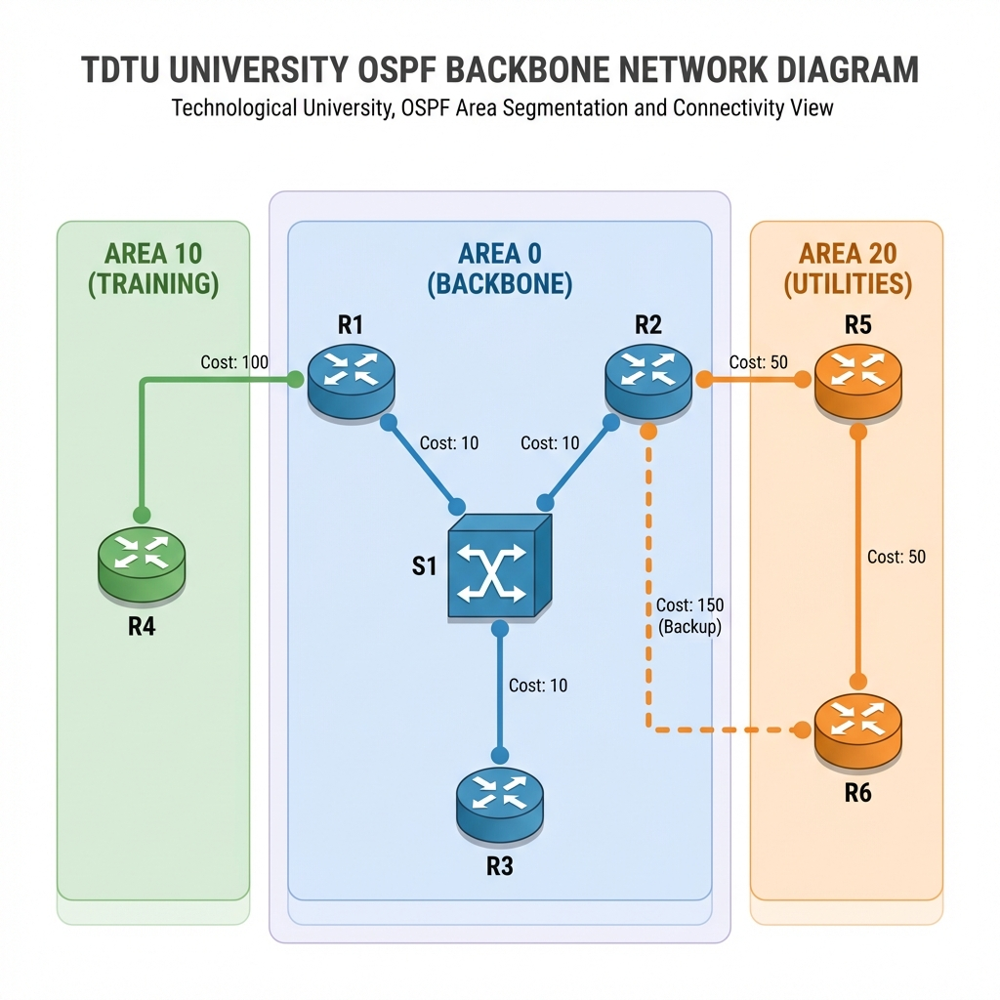
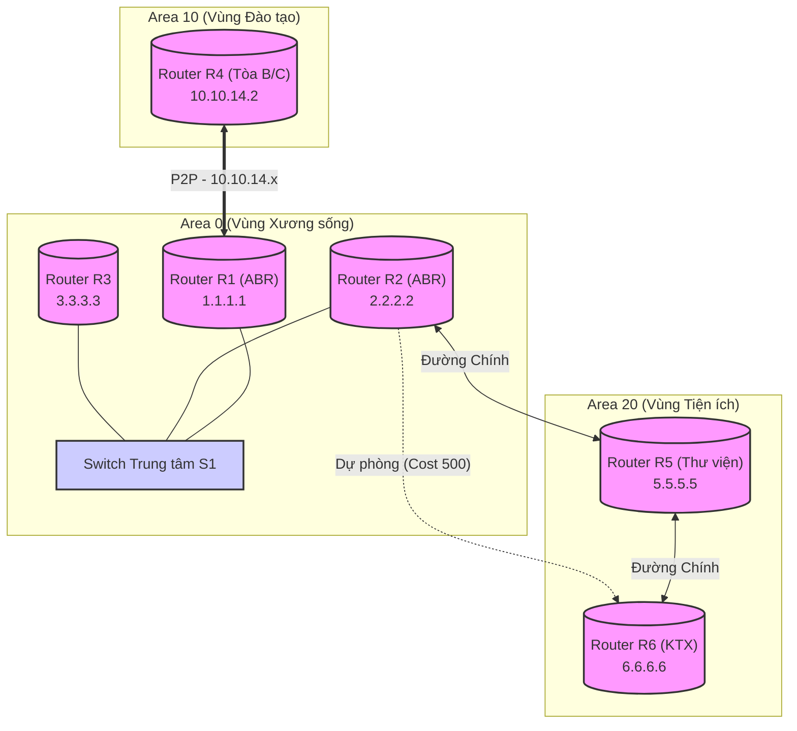

# 🗺️ Kiến trúc & Thiết kế Mạng TDTU (Network Design)

## 📌 Sơ đồ Logic (Mermaid Diagram)

---

## ⚙️ Chi tiết Cấu hình Mạng (Network Interfaces)

Dựa trên mã nguồn `tdtu_ospf.py`, cấu hình các Router và Interface như sau:

| Router | Interface | IP Address | Subnet | OSPF Area | Ghi chú |
| :--- | :--- | :--- | :--- | :--- | :--- |
| **R1** | `r1-eth0` | 10.0.0.1 | /24 | 0 | Kết nối Switch S1 (Backbone) |
| | `r1-eth1` | 10.10.14.1 | /30 | 10 | Kết nối R4 (Đào tạo) |
| **R2** | `r2-eth0` | 10.0.0.2 | /24 | 0 | Kết nối Switch S1 (Backbone) |
| | `r2-eth1` | 10.20.25.1 | /30 | 20 | Kết nối R5 (Thư viện) |
| | `r2-eth2` | 10.20.26.1 | /30 | 20 | Đường dự phòng đến R6 |
| **R3** | `r3-eth0` | 10.0.0.3 | /24 | 0 | Kết nối Switch S1. Priority=0 |
| **R4** | `r4-eth0` | 10.10.14.2 | /30 | 10 | Kết nối R1. P2P Link |
| **R5** | `r5-eth0` | 10.20.25.2 | /30 | 20 | Kết nối R2 |
| | `r5-eth1` | 10.20.56.1 | /30 | 20 | Kết nối R6 |
| **R6** | `r6-eth0` | 10.20.56.2 | /30 | 20 | Kết nối chính đến R5 |
| | `r6-eth1` | 10.20.26.2 | /30 | 20 | Đường dự phòng đến R2 (Cost 500) |

---

## 💡 Giải thích Thiết kế (Design Rationale)

*   **Quy hoạch IP (IP Addressing)**:
    *   **Mạng Backbone (Area 0)**: Sử dụng subnet `/24` (254 host) để mô phỏng mạng LAN rộng lớn, cho phép dễ dàng mở rộng thêm các Core Router trong tương lai.
    *   **Kết nối P2P (Point-to-Point)**: Các liên kết giữa router (ví dụ R1-R4, R2-R5) đều sử dụng subnet `/30`. Đây là chuẩn công nghiệp ("Best Practice") giúp tiết kiệm địa chỉ IP (chỉ có 2 IP khả dụng) và tăng cường bảo mật, ngăn chặn thiết bị lạ cắm vào giữa.
    *   **Quy tắc Đặt tên Subnet**: Địa chỉ IP được quy hoạch gợi nhớ theo ID của Router. Ví dụ: `10.10.14.0` là liên kết trong Area `10` nối R`1` và R`4`.

*   **Chiến lược OSPF**:
    *   **Dự phòng (Redundancy)**: Đường R2-R6 được thiết lập **Cost 500** (cao hơn nhiều so với mặc định). Điều này buộc OSPF chọn đường đi qua R5 (R2→R5→R6) làm đường chính. Đường trực tiếp R2→R6 chỉ được kích hoạt khi R5 gặp sự cố => Đảm bảo tính sẵn sàng cao (High Availability).
    *   **Tối ưu DR/BDR**: R3 được đặt **Priority 0** để không bao giờ trở thành DR (Designated Router). Điều này giúp ổn định mạng Backbone, giữ vai trò điều phối cho các Router quan trọng hơn là R1 và R2 (ABR).
