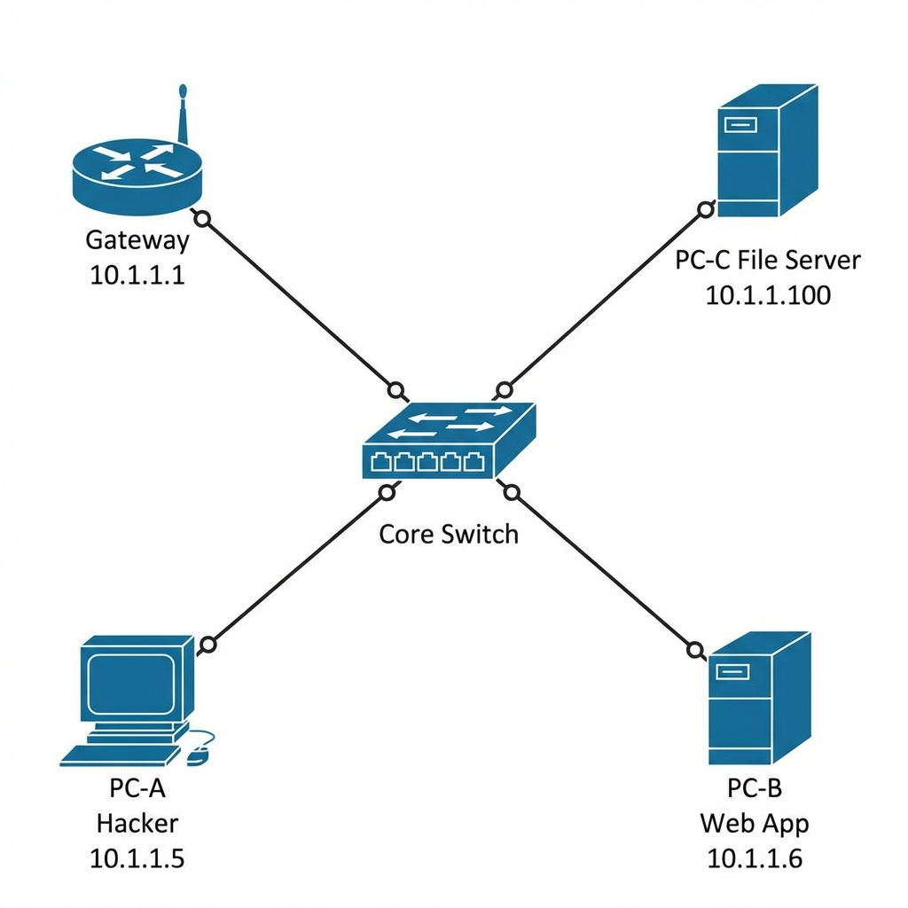
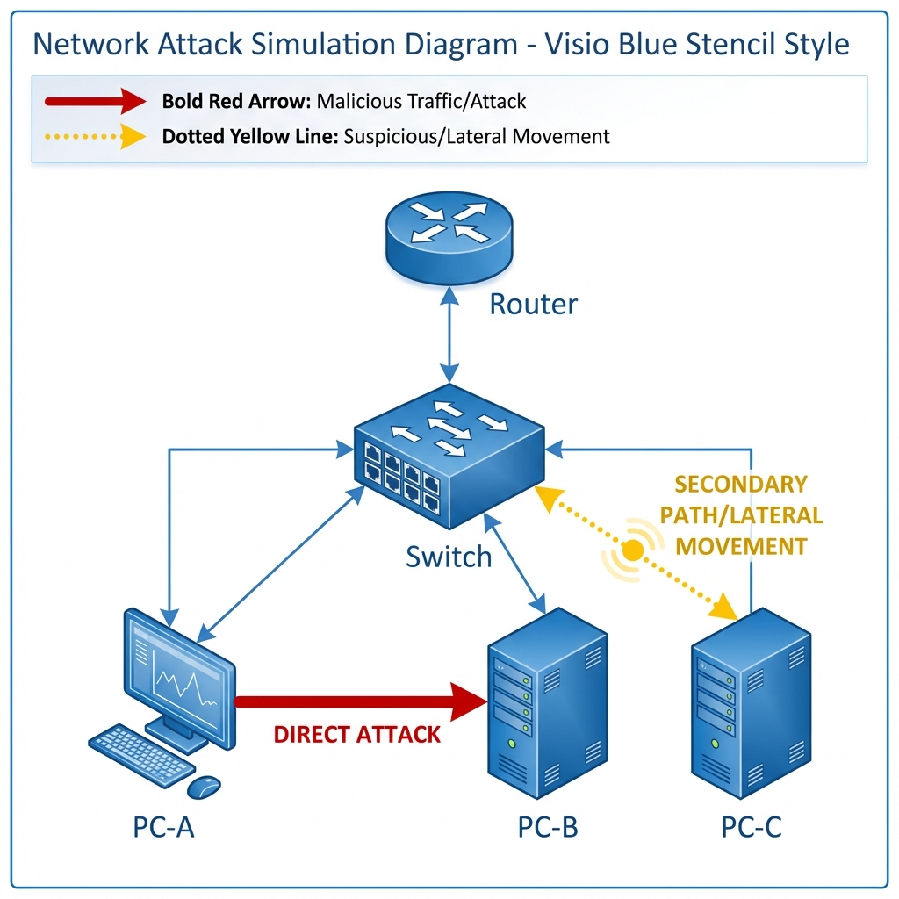

# 📖 CỐT TRUYỆN: CUỘC ĐỘT NHẬP THẦM LẶNG

**Tiêu đề:** Tấn công Lan tỏa trong Mạng Doanh nghiệp (Lateral Movement)

---

## 1. Bối cảnh (The Context)

Một công ty công nghệ vừa và nhỏ sở hữu một hệ thống mạng nội bộ được thiết kế theo kiểu **"Mạng Phẳng" (Flat Network)** truyền thống. Tại đây, các thiết bị được mặc định tin tưởng nhau và có thể giao tiếp tự do.

Sáng nay, một nhân viên phòng kế toán đã vô tình mở một file Excel đính kèm trong email lừa đảo (phishing). Hành động này vô tình kích hoạt một mã độc (malware) tinh vi, biến máy tính của họ (**PC-A**) thành "bệnh nhân số 0". Malware này âm thầm thiết lập một "đường hầm" bí mật (Reverse Shell), trao quyền điều khiển từ xa cho một Hacker chuyên nghiệp.

🎯 **Mục tiêu của Hacker:**
Không phải là phá hoại máy kế toán, mà là **đánh cắp file bảng lương tuyệt mật (`salary.csv`)** đang được lưu trữ trên File Server (**PC-C**) nằm sâu trong mạng nội bộ.

---

## 2. Dàn cảnh (The Stage)

Hãy hình dung phòng server của công ty: ánh sáng xanh dương và tím mờ ảo từ đèn LED, tiếng quạt tản nhiệt ù ù, và những bó dây cáp mạng đủ màu chạy dọc các tủ rack.

*   **🖧 Switch Trung tâm (The Core):** Trái tim của mạng lưới, với đèn LED xanh lá nhấp nháy liên tục, chuyển tiếp mọi gói tin mà không hề hay biết về sự nguy hiểm đang lan truyền.
*   **💻 PC-A (The Patient Zero - Máy Kế toán):** Một máy tính văn phòng bình thường. Trên màn hình là bảng tính Excel vô hại, nhưng chạy ngầm bên dưới là một terminal đen ngòm - nơi Hacker đang gõ lệnh.
*   **🖥️ PC-B (The Stepping Stone - Máy Web Admin):** Một máy chủ cũ kỹ ở góc phòng, chạy ứng dụng quản trị nội bộ lỗi thời. Nó yếu ớt, đầy lỗ hổng, là "bàn đạp" hoàn hảo để Hacker khai thác.
*   **💎 PC-C (The Crown Jewels - File Server):** Máy chủ chứa dữ liệu nhạy cảm. Nó được bảo vệ kỹ càng, nhưng liệu có an toàn trước kẻ thù đã ở bên trong bức tường thành?

---

## 3. Di biến động của Cuộc tấn công

Cuộc chiến giữa **Red Team** (Hacker) và **Blue Team** (Quản trị viên) diễn ra qua 2 màn:

### 🎭 Màn 1: Mạng Phẳng - Sân chơi của Hacker

1.  **Trinh sát (Reconnaissance):**
    Từ PC-A, Hacker tung ra các gói tin thăm dò (ping/scan) tỏa đi khắp mạng lưới như những xúc tu vô hình. Bản đồ mạng hiện ra: hắn tìm thấy PC-B và PC-C.

2.  **Tấn công Lan tỏa (Lateral Movement):**
    Phát hiện PC-B có lỗ hổng, Hacker phóng một mã độc (payload) từ PC-A xuyên qua Switch, găm thẳng vào PC-B.
    💥 *Kết quả:* PC-B bị chiếm quyền điều khiển. Hacker đã có thêm một bàn đạp mới.

3.  **Đánh cắp Dữ liệu (Exfiltration):**
    Từ vị trí thuận lợi PC-B (hoặc trực tiếp từ PC-A nếu không bị chặn), Hacker kết nối tới PC-C. Dữ liệu bảng lương (`salary.csv`) bị sao chép và tuồn ra ngoài Internet.
    💸 *Hậu quả:* Dữ liệu mật bị lộ, công ty thiệt hại nặng nề.

### 🛡️ Màn 2: Kích hoạt Phòng thủ Micro-segmentation

Quản trị viên phát hiện bất thường và kích hoạt hệ thống **Zero Trust**.

1.  **Dựng "Tường lửa ảo":**
    Những bức tường lửa vô hình bao bọc lấy từng máy PC-A, PC-B, PC-C. Chúng nằm ngay tại cổng Switch, kiểm soát mọi hơi thở của mạng.

2.  **Hacker bị chặn đứng:**
    Hacker cố gắng lặp lại kỹ thuật tấn công từ PC-A sang PC-B. Nhưng lần này, gói tin độc hại va phải bức tường lửa ảo và tan biến.
    🚫 *Thông báo:* `CONNECTION REFUSED`. Hacker bị cô lập.

3.  **Truy cập hợp lệ (Business Continuity):**
    Tuy nhiên, công việc vẫn phải tiếp diễn. Một "hành lang an toàn" (Allow List) được mở riêng cho phép PC-A truy cập PC-C **chỉ qua cổng HTTPS (443)** để lấy dữ liệu phục vụ công việc. Mọi hành vi khác đều bị cấm.
