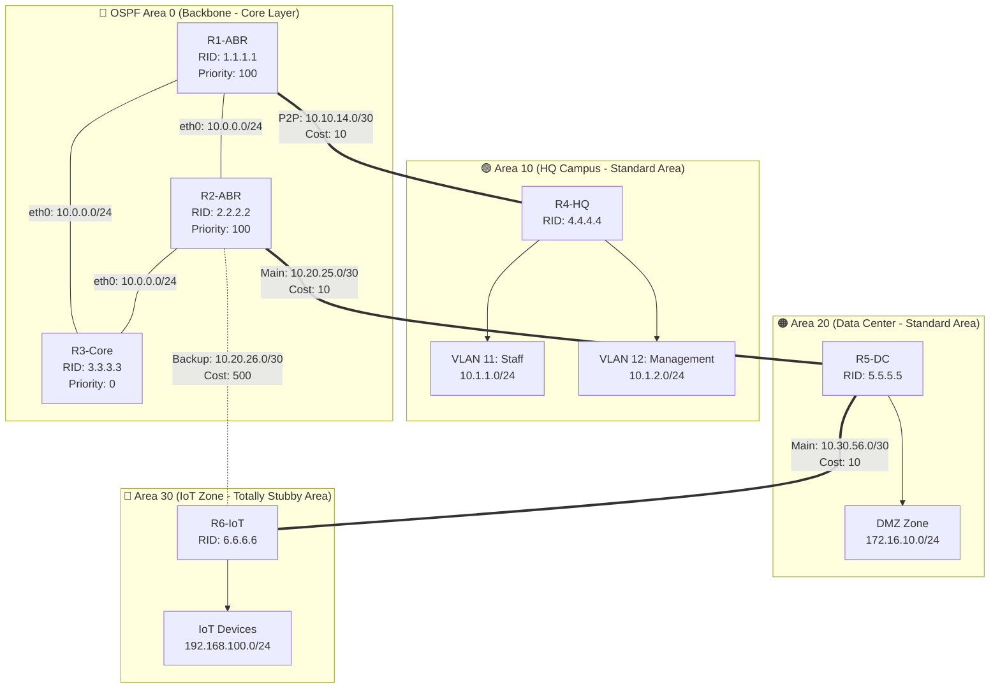

# X

THIẾT KẾ KIẾN TRÚC MẠNG

**Blueprint chi tiết cho hệ thống**

---

## I. TỔNG QUAN TOPOLOGY

Hệ thống được thiết kế theo mô hình hierarchical 3-layer với OSPF Multi-Area:
- **6 Routers** (R1-R6)
- **4 OSPF Areas** (0, 10, 20, 30)
- **4 Security Zones** (Core, HQ, DMZ, IoT)
- **Switches** tại Access Layer (không cần cấu hình routing)

---

## II. SƠ ĐỒ MẠNG CHI TIẾT

### Sơ đồ Vật lý (Physical Topology)

```
                    AREA 0 (BACKBONE)
        ┌──────────────────────────────────┐
        │                                  │
        │     R1 ───── R2 ───── R3         │
        │   (ABR)    (ABR)    (Core)       │
        │  1.1.1.1   2.2.2.2  3.3.3.3      │
        │     │        │   └────┐           │
        └─────┼────────┼────────┼───────────┘
              │        │        │
      ┌───────┴───┐ ┌──┴───┐ ┌─┴────────┐
      │           │ │      │ │          │
   Area 10     Area 20  Area 30
   (HQ)        (DMZ)    ( IoT-Stub)
      │           │        │
      R4          R5       R6
   4.4.4.4     5.5.5.5  6.6.6.6
      │           │        │
   ┌──┴──┐     ┌─┴─┐   ┌──┴──┐
   │     │     │DMZ│   │ IoT │
 Staff Mgmt   Zone   Devices
```

### Sơ đồ Logic với OSPF Areas



---

## III. QUY HOẠCH ĐỊA CHỈ IP

### Bảng địa chỉ IP đầy đủ

| Router | Interface | Địa chỉ IP | Subnet Mask | Kết nối đến | OSPF Area | Network Type |
|:---|:---|:---|:---|:---|:---:|:---|
| **R1** | eth0 | 10.0.0.1 | /24 | Backbone Switch | 0 | Broadcast |
|  | eth1 | 10.10.14.1 | /30 | R4 (HQ) | 10 | Point-to-Point |
|  | lo0 | 1.1.1.1 | /32 | Loopback (RID) | 0 | Loopback |
| **R2** | eth0 | 10.0.0.2 | /24 | Backbone Switch | 0 | Broadcast |
|  | eth1 | 10.20.25.1 | /30 | R5 (DMZ) | 20 | Point-to-Point |
|  | eth2 | 10.20.26.1 | /30 | R6 (IoT-Backup) | 30 | Point-to-Point |
|  | lo0 | 2.2.2.2 | /32 | Loopback (RID) | 0 | Loopback |
| **R3** | eth0 | 10.0.0.3 | /24 | Backbone Switch | 0 | Broadcast |
|  | lo0 | 3.3.3.3 | /32 | Loopback (RID) | 0 | Loopback |
| **R4** | eth0 | 10.10.14.2 | /30 | R1 | 10 | Point-to-Point |
|  | eth1 | 10.1.1.254 | /24 | VLAN 11 (Staff) | 10 | Broadcast |
|  | eth2 | 10.1.2.254 | /24 | VLAN 12 (Management) | 10 | Broadcast |
|  | lo0 | 4.4.4.4 | /32 | Loopback (RID) | 10 | Loopback |
| **R5** | eth0 | 10.20.25.2 | /30 | R2 | 20 | Point-to-Point |
|  | eth1 | 10.30.56.1 | /30 | R6 (Main) | 20 | Point-to-Point |
|  | eth2 | 172.16.10.254 | /24 | DMZ Zone | 20 | Broadcast |
|  | lo0 | 5.5.5.5 | /32 | Loopback (RID) | 20 | Loopback |
| **R6** | eth0 | 10.30.56.2 | /30 | R5 (Main) | 30 | Point-to-Point |
|  | eth1 | 10.20.26.2 | /30 | R2 (Backup) | 30 | Point-to-Point |
|  | eth2 | 192.168.100.254 | /24 | IoT Zone | 30 | Broadcast |
|  | lo0 | 6.6.6.6 | /32 | Loopback (RID) | 30 | Loopback |

### Quy hoạch Hosts/Servers

| Device | IP Address | Gateway | VLAN/Zone | Purpose |
|:---|:---|:---|:---|:---|
| Admin PC | 10.1.2.50 | 10.1.2.254 | VLAN 12 (Mgmt) | SSH admin, management |
| File Server | 10.1.2.100 | 10.1.2.254 | VLAN 12 (Mgmt) | Salary database, HR files |
| Employee PC1 | 10.1.1.10 | 10.1.1.254 | VLAN 11 (Staff) | Generic office work |
| Employee PC2 | 10.1.1.11 | 10.1.1.254 | VLAN 11 (Staff) | Generic office work |
| Web Server | 172.16.10.100 | 172.16.10.254 | DMZ | Public website (HTTP/HTTPS) |
| Email Server | 172.16.10.101 | 172.16.10.254 | DMZ | Mail service (SMTP/IMAP) |
| Syslog Server | 172.16.10.200 | 172.16.10.254 | DMZ | Log aggregation (UDP 514) |
| IoT Camera 1 | 192.168.100.10 | 192.168.100.254 | IoT Zone | Warehouse surveillance |
| IoT Camera 15 | 192.168.100.15 | 192.168.100.254 | IoT Zone | **COMPROMISED DEVICE** |
| Sensor 1 | 192.168.100.50 | 192.168.100.254 | IoT Zone | Temperature sensor |

---

## IV. THIẾT KẾ OSPF MULTI-AREA

### Bảng tóm tắt OSPF Areas

| Area ID | Type | Description | Routers | Special Config |
|:---:|:---|:---|:---|:---|
| **0** | Backbone | Core network | R1, R2, R3 | R3 priority=0 (never DR) |
| **10** | Standard | HQ Campus | R1 (ABR), R4 | Normal inter-area routing |
| **20** | Standard | DMZ/Data Center | R2 (ABR), R5, R6 | Normal inter-area routing |
| **30** | **Totally Stubby** | IoT Zone (untrusted) | R2 (ABR), R6 | `area 30 stub no-summary` on R2 |

### Tại sao Area 30 là Totally Stubby?

**Mục tiêu:** Che giấu kiến trúc mạng khỏi IoT zone

**So sánh các loại Area:**

| Area Type | Nhận LSA Type 3? | Nhận LSA Type 5? | Default Route |
|:---|:---:|:---:|:---|
| **Standard** | ✅ Yes | ✅ Yes | No (unless configured) |
| **Stub** | ✅ Yes | ❌ No | Auto-injected by ABR |
| **Totally Stubby** | ❌ No | ❌ No | Auto-injected by ABR |

**Kết quả trên R6 (IoT Router):**
```
R6# show ip route
Codes: O - OSPF, O*IA - OSPF inter-area default

Gateway of last resort is 10.30.56.1 to network 0.0.0.0

O*IA  0.0.0.0/0 [110/2] via 10.30.56.1
C     192.168.100.0/24 is directly connected, eth2
C     10.30.56.0/30 is directly connected, eth0
C     10.20.26.0/30 is directly connected, eth1
```

❌ **KHÔNG** có route đến `10.1.2.0/24` (Management)  
❌ **KHÔNG** có route đến `10.1.1.0/24` (Staff)  
❌ **KHÔNG** có route đến `172.16.10.0/24` (DMZ)

→ Hacker không biết target IP nào để tấn công!

---

## V. BACKUP ROUTES & FAILOVER

### Thiết kế đường dự phòng

**Đường chính:** R2 → R5 → R6 (Cost: 20)  
**Đường dự phòng:** R2 → R6 trực tiếp (Cost: 500)

**Cách hoạt động:**
- Bình thường: Traffic đi qua R5 (cost thấp hơn)
- Khi R5 down: OSPF tự động chuyển sang R2→R6 trực tiếp

**Tại sao không dùng cost bằng nhau để load-balance?**
- Load-balance có thể gây asymmetric routing
- Khó troubleshoot khi có vấn đề
- Trong môi trường production, thường ưu tiên **predictability** hơn **load distribution**

---

## VI. PHÂN VÙNG BẢO MẬT (SECURITY ZONES)

### Bảng Security Zones

| Zone Name | Subnet(s) | Trust Level | Allowed Outbound | Allowed Inbound |
|:---|:---|:---:|:---|:---|
| **Management** | 10.1.2.0/24 | 🔴 Critical | Toàn bộ (trusted users) | Chỉ từ Admin PC |
| **Staff** | 10.1.1.0/24 | 🟡 Medium | Internet, DMZ (HTTPS only) | Không từ IoT, không từ DMZ |
| **DMZ** | 172.16.10.0/24 | 🟠 Public | Internet only | Internet (80/443/25/143), Staff (443 only) |
| **IoT** | 192.168.100.0/24 | 🔴 Untrusted | Internet (limited), Syslog | Không ai được vào |

### ma trận Trust Relationships

|  | → Management | → Staff | → DMZ | → IoT | → Internet |
|:---|:---:|:---:|:---:|:---:|:---:|
| **From Management** | ✅ | ✅ | ✅ (monitoring) | ❌ | ✅ |
| **From Staff** | ❌ | ✅ | ✅ (HTTPS only) | ❌ | ✅ |
| **From DMZ** | ❌ | ❌ | ✅ | ❌ | ✅ |
| **From IoT** | ❌ | ❌ | ⚠️ (Syslog only) | ✅ | ⚠️ (limited) |
| **From Internet** | ❌ | ❌ | ✅ (80/443) | ❌ | N/A |

✅ = Allowed  
❌ = Deny All  
⚠️ = Conditional (specific ports/IPs only)

---

## VII. CHIẾN LƯỢC ĐẶT ACLs

### Nguyên tắc chung

1. **Extended ACLs đặt gần nguồn** (source) để lọc sớm
2. **Standard ACLs đặt gần đích** (destination) để tránh chặn traffic hợp lệ
3. **Inbound ACLs** thường hiệu quả hơn outbound (kiểm tra trước khi routing decision)
4. **Thứ tự rules quan trọng:** Permit trước, Deny sau, Implicit deny cuối cùng

### Danh sách ACLs cần triển khai

| ACL Number | Name | Location | Direction | Purpose |
|:---:|:---|:---|:---:|:---|
| **100** | Core-Protection | R1/R2/R3 - all interfaces | IN | Protect backbone (only OSPF + admin SSH) |
| **110** | IoT-Isolation | R6 - eth2 (IoT zone) | IN | Block IoT → Internal zones |
| **120** | DMZ-Security | R5 - eth2 (DMZ zone) | IN | Block DMZ → Inside, allow Internet → DMZ |
| **130** | Staff-Policy | R4 - eth1 (VLAN Staff) | IN | Block Staff → Management, allow Staff → DMZ HTTPS |
| **140** | SSH-Access-Control | All Routers - VTY lines | IN | Only Admin PC can SSH |

---

## VIII. GHI CHÚ THIẾT KẾ

### Tại sao dùng Loopback interfaces?

**Router ID (RID) nên dùng Loopback vì:**
- Loopback không bao giờ down (trừ khi router reboot)
- Physical interface down → RID thay đổi → OSPF adjacency reset → downtime
- Best practice trong production

### Tại sao dùng /30 cho point-to-point links?

**Subnet /30 chỉ có 2 IP khả dụng:**
- Tiết kiệm địa chỉ IP
- Bảo mật: Không có IP "thừa" để attacker cắm thiết bị giả
- Chuẩn công nghiệp

Compare:
- /24: 254 IPs (lãng phí 252 IPs trên link P2P)
- /30: 2 IPs (perfect cho 2 routers)

### Tại sao R3 có priority 0?

- Priority 0 = Never become DR/BDR
- R3 là Internal Router (không làm ABR)
- Giảm overhead, tập trung resource vào forwarding traffic
- DR/BDR nên là R1 và R2 (vì chúng là ABR, quan trọng hơn)

---

## IX. CHECKLIST THIẾT KẾ

Trước khi bắt đầu triển khai, kiểm tra:

- [ ] IP addressing không bị duplicate
- [ ] Mỗi router có Router ID rõ ràng (loopback /32)
- [ ] P2P links dùng /30 subnet
- [ ] Area 30 được đánh dấu là Totally Stubby
- [ ] Backup path có Cost cao hơn main path
- [ ] Mỗi security zone có subnet riêng biệt
- [ ] ACL placement đã được lên kế hoạch

---

**BÂY GIỜ, HÃY TRIỂN KHAI THIẾT KẾ NÀY TRÊN MININET!**

Chuyển sang [REQUIREMENTS.md](./REQUIREMENTS.md) để xem yêu cầu kỹ thuật chi tiết.
