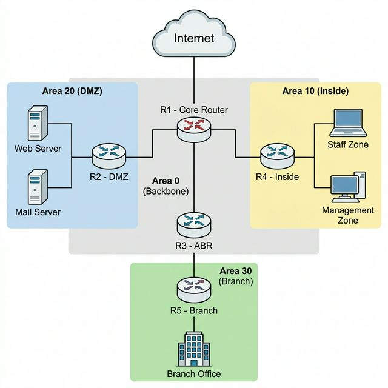

# PHÂN TÍCH LUỒNG GÓI TIN TRONG MẠNG ĐA VÙNG
## Tích hợp OSPF Multi-Area + ACLs + DMZ + Wireshark

---

## THÔNG TIN ĐỀ TÀI

**Tên đề tài:** Quan sát và phân tích hành vi thực tế của mạng doanh nghiệp đa vùng —
từ cơ chế định tuyến OSPF bên trong đến luồng gói tin xuyên DMZ, qua lô-gic kiểm soát truy cập ACL.

**Bối cảnh:**

Công ty NetFlow Corp vừa hoàn thành giai đoạn triển khai hạ tầng mạng mới gồm định tuyến OSPF
Multi-Area, phân vùng bảo mật (Inside / DMZ / Branch) và chính sách ACL. Tuy nhiên, đội kỹ thuật
chưa thực sự hiểu **tại sao** hệ thống hoạt động đúng — hay sai — ở từng điểm cụ thể.

Bạn được giao nhiệm vụ **Verification Engineer**: không cấu hình thêm, mà dùng Wireshark, tcpdump
và các công cụ phân tích để *chứng minh bằng bằng chứng gói tin* rằng toàn bộ chính sách mạng
đang vận hành đúng như thiết kế.

**Nền tảng kiến thức:**
- RFC 2328 — OSPF Version 2
- Kiến trúc mạng phân tầng (Core / Distribution / Access)
- Nguyên lý kiểm soát truy cập theo hướng (stateless ACL)
- Các nguyên tắc thiết kế DMZ

---

## MỤC TIÊU VÀ NHIỆM VỤ

### I. Mục tiêu

Đề tài hướng đến việc xây dựng năng lực **đọc và giải thích** hành vi mạng từ góc nhìn gói tin —
không phải từ góc nhìn cấu hình. Cụ thể:

- Nhìn thấy và giải thích từng loại bản tin OSPF đang chạy trong mạng
- Chứng minh đường đi thực tế của gói tin qua từng hop bằng packet capture
- Xác định chính xác điểm gói tin bị block và lý do tại sao ACL được đặt ở đó
- Đo và giải thích hành vi mạng khi có sự cố (link failure, convergence)

### II. Nhiệm vụ cụ thể

**Phần A. Thiết kế và dựng mô hình mạng**

Tự thiết kế và xây dựng topology trên Mininet + FRRouting gồm:
- 5 routers phân thành 4 OSPF Areas: Area 0 (Backbone), Area 10 (Inside HQ), Area 20 (DMZ), Area 30 (Branch)
- Các security zones: Inside (Staff + Management subnets), DMZ (Web Server + Mail Server), Branch Office
- Extended ACL kiểm soát luồng traffic giữa các zone theo nguyên tắc least privilege
- Quy hoạch IP addressing hoàn chỉnh cho tất cả routers, interfaces và end-hosts

**Phần B. Phân tích OSPF bên trong**

Capture và phân tích toàn bộ quá trình từ lúc OSPF chưa có neighbor đến khi đạt trạng thái FULL:

- Bắt buộc phân tích đủ 5 loại bản tin: Hello, DBD, LSR, LSU, LSAck
- Xác định DR/BDR election: ai thắng và tại sao
- Phân biệt LSA Type 1, 2, 3 — cái nào xuất hiện ở link nào, tại sao
- Đo thời gian convergence từ lúc bật OSPF đến FULL state

**Phần C. Trace đường đi gói tin**

Với mỗi kịch bản traffic, capture đồng thời trên tất cả links liên quan và lập bảng đầy đủ:

- Kịch bản 1: Staff-PC → Web Server (Inside → DMZ)
- Kịch bản 2: Branch-PC → Management PC (Branch → Inside, cross-area)
- Kịch bản 3: Web Server → Management PC (DMZ → Inside — traffic này có đến đích không?)

**Phần D. Xác minh ACL bằng packet capture**

Không được chỉ dựa vào kết quả ping. Phải chứng minh bằng PCAP:
- Gói tin nào bị block: capture ở hai phía của điểm block (trước và sau interface ACL)
- Gói tin nào được phép: dùng `follow TCP stream` để xem full session
- Hit counter của mỗi ACL rule sau từng test case

**Phần E. Phân tích Failover**

Gây ra link failure và đo thời gian OSPF phản ứng:
- Tắt một link trên đường đi đang hoạt động
- Ghi lại timestamp các sự kiện: neighbor dead → LSA flood → route update → traffic khôi phục
- So sánh traceroute trước và sau failure

**Phần F. Báo cáo kỹ thuật**

Toàn bộ kết quả phải được trình bày kèm PCAP evidence. Báo cáo không có PCAP = không được chấp nhận.

---

## MÔ HÌNH MẠNG THAM KHẢO



| Area | Vai trò | Routers | Subnets |
|:---|:---|:---|:---|
| Area 0 | Backbone / Transit | R1, R3 | Link subnets /30 |
| Area 10 | Inside HQ | R1, R4 | Staff /24, Management /24 |
| Area 20 | DMZ | R1, R2 | DMZ servers /24 |
| Area 30 | Branch | R3, R5 | Branch /24 |

**ACL Policy tối thiểu cần triển khai:**

| Từ | Đến | Chính sách |
|:---|:---|:---|
| Inside | DMZ | Cho phép HTTP/HTTPS, DNS — chặn tất cả còn lại |
| DMZ | Inside | **Chặn toàn bộ** kết nối khởi tạo từ DMZ |
| Branch | Inside | Cho phép có chọn lọc (tự định nghĩa) |
| Outside | DMZ | Chỉ cho phép HTTP/HTTPS vào Web Server |
| Outside | Inside | **Chặn toàn bộ** |

**Lưu ý thiết kế:** Bài lab không cung cấp cấu hình mẫu. Sinh viên phải tự xác định
ACL đặt ở interface nào, direction nào (inbound/outbound), và viết từng rule.

---

## KẾT QUẢ MONG ĐỢI

### 1. Mô hình mạng hoạt động
Topology Mininet chạy ổn định với đầy đủ OSPF neighbor ở trạng thái FULL,
bảng định tuyến đầy đủ trên tất cả routers.

### 2. Bộ PCAP evidence

Tối thiểu các file sau:

| File | Nội dung |
|:---|:---|
| `ospf_convergence.pcap` | Toàn bộ quá trình từ Down → Full trên một link |
| `packet_flow_A.pcap` | Staff → DMZ, capture tất cả hops |
| `packet_flow_B.pcap` | Branch → Inside, capture tất cả hops |
| `acl_block.pcap` | DMZ → Inside bị chặn (capture cả hai phía ACL) |
| `acl_allow.pcap` | Inside → DMZ được phép (full TCP session) |
| `failover.pcap` | Từ lúc link đứt đến lúc traffic khôi phục |

### 3. Báo cáo kỹ thuật

Trả lời đầy đủ tất cả câu hỏi ở phần dưới, kèm PCAP screenshot và lệnh verify.

---

## BỘ CÂU HỎI — CỐT LÕI CỦA BÀI LAB

Đây là phần trọng tâm. Sinh viên phải tự trả lời toàn bộ bằng kết quả thực nghiệm.

### Nhóm 1: Cơ chế OSPF bên trong

1. Khi bạn capture OSPF trên một link point-to-point (R1↔R4), IP đích của Hello packet là gì?
   Tại sao là địa chỉ đó? Điều gì xảy ra nếu một end-host nằm trên cùng segment cũng nhận được packet này?

2. Khi hai router lần đầu kết nối, chúng phải trải qua các state: Down → Init → 2-Way → ExStart → Exchange → Loading → Full.
   Nhìn vào PCAP, packet nào đánh dấu sự chuyển từ *Init sang 2-Way*? Trường nào trong packet đó thay đổi so với Hello trước?

3. Trong quá trình Exchange, router nào đóng vai Master và ai là Slave? Dựa vào gì để xác định?
   Sequence number của DBD packet thay đổi như thế nào giữa Master và Slave?

4. Tại sao cần có LSAck sau mỗi LSU? Điều gì xảy ra nếu LSAck không đến? OSPF xử lý thế nào?

5. Nhìn vào LSDB của R5 (Branch): bạn thấy những loại LSA nào? Tại sao R5 không có Type 1 LSA của R4 trong database?
   Thông tin về subnet 192.168.10.0/24 (Inside Staff) đến R5 dưới dạng LSA loại mấy? Ai tạo ra LSA đó?

6. Nếu link R1↔R3 bị đứt đột ngột, R3 phát hiện điều này sau bao nhiêu giây? Thông qua cơ chế nào?
   Capture và tìm packet đầu tiên cho thấy OSPF biết link đã chết.

7. Sau khi link đứt, traffic từ Branch → Inside còn đi được không?
   Nếu không, tại sao? Nếu được, đường đi mới là gì? Tìm sự kiện trong PCAP chứng minh.

### Nhóm 2: Hành vi gói tin và routing

8. Gửi một gói tin ICMP từ Staff-PC đến Web Server. Capture trên link R4↔R1 và link R1↔R2.
   So sánh hai file PCAP: trường nào giống nhau hoàn toàn? Trường nào khác nhau? Giải thích tại sao.

9. Trong bảng routing của R4 (`show ip route`), route đến DMZ subnet (172.16.x.x) được đánh ký hiệu gì?
   Ký hiệu đó có nghĩa là gì? Tại sao route này không phải loại `O` thông thường mà là `O IA`?

10. Dùng traceroute từ Branch-PC đến Management-PC. Liệt kê từng hop theo thứ tự.
    Tại sao gói tin phải đi qua Area 0 dù R3 và R4 "gần nhau" hơn? OSPF có vị trí rẽ tắt (shortcut) không?

11. Gửi 100 gói tin ICMP từ Staff-PC đến Web Server. Nhìn vào trường TTL của gói tin đến tại Web Server.
    TTL đó là bao nhiêu? Tính ngược lại: TTL ban đầu của gói tin là bao nhiêu?

12. Sử dụng Wireshark filter `icmp.seq == 1` trên ba file PCAP khác nhau (ba link khác nhau).
    Đây có phải cùng một gói tin không? Bằng chứng nào chứng minh?

### Nhóm 3: ACL và DMZ — Tại sao đặt ở đó

13. Trước khi viết bất kỳ ACL nào, hãy dùng Wireshark để quan sát traffic tự nhiên giữa DMZ và Inside.
    Không có ACL, Web Server có thể ping Management-PC không? Capture và ghi lại.

14. Bây giờ áp dụng ACL block DMZ → Inside. Capture ở **hai phía** của interface ACL:
    phía vào (inbound) và phía ra (outbound trên interface khác). Ở phía nào gói tin biến mất?
    Điều này cho thấy ACL được xử lý ở thời điểm nào trong quá trình forwarding?

15. Tại sao ACL chặn DMZ → Inside được đặt ở router, không phải ở Web Server?
    Nếu đặt firewall trực tiếp trên Web Server (host-based), có đủ không? Ưu và nhược điểm?

16. Chạy `show ip access-lists` trước và sau khi Web Server thử kết nối vào Inside.
    Hit counter của rule nào tăng? Nếu counter không tăng dù traffic rõ ràng thấy trong PCAP,
    điều đó có nghĩa là gì?

17. Tại sao DMZ tồn tại? Nếu không có DMZ mà Web Server đặt thẳng vào Inside, rủi ro gì phát sinh?
    Dùng Wireshark để mô phỏng: nếu Web Server bị chiếm quyền và tự gửi packet vào Management-PC,
    packet đó đi qua những router nào trước khi bị (hoặc không bị) chặn?

18. Extended ACL khác Standard ACL ở điểm nào cụ thể? Thử viết cùng một policy bằng Standard ACL.
    Nếu không thể viết giống hoàn toàn, điểm nào khác biệt ảnh hưởng đến bảo mật?

19. Một ACL rule "permit ip any any" ở cuối danh sách có ý nghĩa gì?
    Nếu bỏ rule đó và chỉ dựa vào implicit deny, hành vi có thay đổi không?
    Capture và kiểm tra với một loại traffic mà bạn không viết rule nào cho nó.

### Nhóm 4: Công cụ và phân tích

20. Bạn nghi ngờ một gói tin bị drop nhưng không biết ở đâu. Mô tả quy trình từng bước để xác định
    chính xác router nào, interface nào, và rule nào đang drop gói tin đó. Liệt kê từng lệnh sẽ dùng.

21. Dùng filter Wireshark `ospf.msg == 4` để xem LSU packets. Mỗi LSU có thể chứa nhiều LSA.
    Tìm một LSU chứa nhiều hơn 1 LSA. Mỗi LSA trong đó thuộc Type mấy? Nó mô tả thông tin gì?

22. Wireshark có tính năng "Follow TCP Stream". Dùng nó trên một kết nối HTTP từ Staff-PC → Web Server.
    Bạn thấy gì trong nội dung HTTP request? Nếu bạn là attacker đang sniff link R1↔R2, bạn thấy gì?
    Điều này gợi lên nhu cầu gì cho thiết kế mạng?

23. Dùng `tshark` (CLI version của Wireshark) để extract tự động danh sách tất cả IP pairs
    đã giao tiếp trong một file PCAP. Lệnh nào làm được điều đó? Kết quả trông như thế nào?

24. Sau khi link failure và recovery, chạy `show ip ospf neighbor` và `show ip route` trên R1.
    Thứ tự output của neighbor list và route table có thay đổi không so với trước failure?
    Điều này nói lên điều gì về cơ chế preemption của OSPF?

---

## CẤU TRÚC THƯ MỤC

```
Lab4_Packet_Analysis/
├── Lab4_Packet_Analysis.md    ← File này
├── src/
│   └── topology.py            ← [Sinh viên tự viết]
├── captures/
│   ├── ospf_convergence.pcap
│   ├── packet_flow_A.pcap
│   ├── packet_flow_B.pcap
│   ├── acl_block.pcap
│   ├── acl_allow.pcap
│   └── failover.pcap
└── report/
    └── report.pdf             ← Báo cáo cuối
```

**Lưu ý:** Bài lab không cung cấp `topology.py`, không cung cấp cấu hình router mẫu, không có ACL script.
Sinh viên tự nghiên cứu và xây dựng từ đầu.

---

## TÀI LIỆU THAM KHẢO

- RFC 2328 — OSPF Version 2
- Wireshark User Guide — wireshark.org/docs
- FRRouting Documentation — docs.frrouting.org
- Mininet Walkthrough — mininet.org/walkthrough
- Lab1\_OSPF, Lab2\_ACLs, Lab3\_Network\_Hardening trong series này

---

**Tác giả:** Trần Thanh Nhã — Huỳnh Văn Dũng  
**Phiên bản:** 1.0 (Tháng 3/2026)

> *"The network never lies. The packets tell the truth."*
